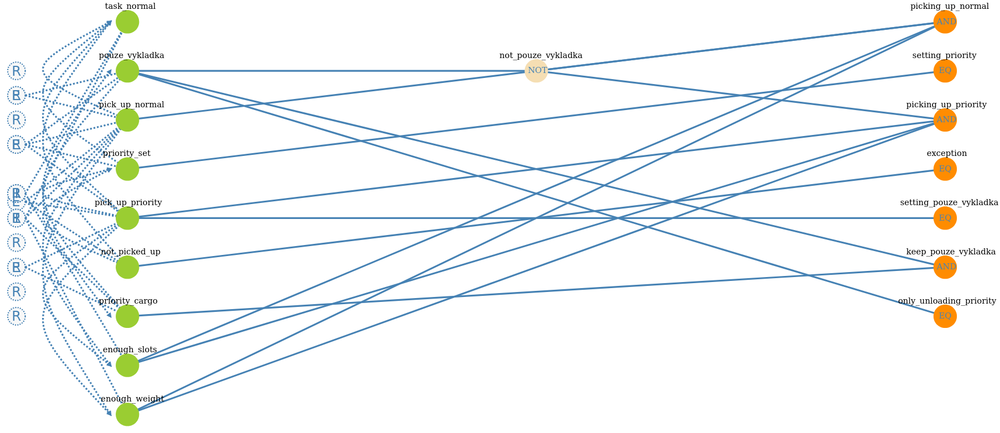

# Dokumentace testů

- Dokumentace testů pro pohyb automatizovaného vozíku v továrně.
- Projekt 1 do předmětu ATA.
- Autor: Michal Šedý (xsedym02@vutbr.cz)

**Obsah**
- [CEG graf a výsledná rozhodovací tabulka.](#ceg-graf-a-výsledná-rozhodovací-tabulka)
  - [CEG graf](#ceg-graf)
  - [Rozhodovací tabulka](#rozhodovací-tabulka)
- [Identifikace vstupních parametrů](#identifikace-vstupních-parametrů)
- [Popis charakteristiky parametrů a omezení](#popis-charakteristiky-parametrů-a-omezení)
  - [Popis charakteristiky parametrů](#popis-charakteristiky-parametrů)
  - [Omezení](#omezení)
- [Tabulka kombinačních testů](#tabulka-kombinačních-testů)
- [Pokrytí testů](#pokrytí-testů)
  - [Testoví podle rozhodovací tabulky](#testoví-podle-rozhodovací-tabulky)
  - [Kombinační testy](#kombinační-testy)
- [Závěr](#závěr)

## CEG graf a výsledná rozhodovací tabulka.

CEG graf a rozhodovací tabulka byly vytvořeny pomocí nástroje [ceg.testos.org](http://ceg.testos.org).

### CEG graf

Předpis pro graf se nachází v souboru `ceg.txt`.



### Rozhodovací tabulka

Rozhodovací tabulka pokrývá všechny příčiny a všechny důsledky.

| Jméno                       | Popis                                                               |    1    |    2    |    3    |    4    |    5    |    6    |
| --------------------------- | ------------------------------------------------------------------- | :-----: | :-----: | :-----: | :-----: | :-----: | :-----: |
| task_normal                 | Zadán požadavek na neprioritní přesun                               |    0    |    1    |    1    |    1    |    1    |    1    |
| pouze_vykladka              | Vozík je v režimu pouze_vykladka                                    |    0    |    0    |    0    |    0    |    0    |    1    |
| pick_up_normal              | Vyzvednutí neprioritního materiálu (<1 min od zadání požadavku)     |    0    |    1    |    0    |    0    |    0    |    0    |
| priority_set                | Nastavení priority přesunu materiálu (1 min od zadání požadavku)    |    0    |    0    |    1    |    1    |    1    |    1    |
| pick_up_priority            | Vyzvednutí prioritního materiálu (< 1 min od nastavení priority)    |    0    |    0    |    1    |    0    |    0    |    0    |
| not_picked_up               | Nevyzvednutí prioritního materiálu (>= 1 min od nastavení priority) |    0    |    0    |    0    |    1    |    1    |    1    |
| priority_cargo              | Vozík má naložený prioritní materiál                                |    0    |    0    |    0    |    0    |    0    |    1    |
| enough_slots                | Vozík má dostatečný počet volných slotů                             |    1    |    1    |    1    |    0    |    1    |    1    |
| enough_weight               | Vozík nebude po vyzvednutí materiálu přetížen                       |    1    |    1    |    1    |    1    |    0    |    1    |
| **picking_up_normal**       | **Vozík vyzvedá neprioritní materiál**                              | `false` | `true`  | `false` | `false` | `false` | `false` |
| **setting_priority**        | **Materiál se stává prioritním**                                    | `false` | `false` | `true`  | `true`  | `true`  | `true`  |
| **picking_up_priority**     | **Vozík vyzvedá prioritní materiál**                                | `false` | `false` | `true`  | `false` | `false` | `false` |
| **exception**               | **Vyvolání výjimky (prioritní náklad nebyl naložen do 1 min**)      | `false` | `false` | `false` | `true`  | `true`  | `true`  |
| **setting_pouze_vykladka**  | **Nastavení režimu pouze_vykladka**                                 | `false` | `false` | `true`  | `false` | `false` | `false` |
| **keep_pouze_vykladka**     | **Pokračuje v režimu pouze_vykladka**                               | `false` | `false` | `false` | `false` | `false` | `true`  |
| **only_unloading_priority** | **Nevyzvedá žádný materiál, pouze vykládá prioritní materiál**      | `false` | `false` | `false` | `false` | `false` | `true`  |


## Identifikace vstupních parametrů

Následující tabulka obsahuje vstupní parametry vybrané pro kombinační testování.

| Název            | Popis                                                           |
| ---------------- | --------------------------------------------------------------- |
| `slots`          | Počet slotů vozíku                                              |
| `capacity`       | Maximální nosnost vozíků                                        |
| `cargo_src`      | Zastávka pro vyzvednutí materiálu                               |
| `cargo_dst`      | Cílová zastávka pro vyložení materiálu                          |
| `cargo_overload` | Označuje, zda existuje materiál, který je na vozík moc těžký    |
| `cargo_0s`       | Označuje, zda je první požadavek naplanovan na 0 sec            |
| `cargo_delay`    | Označuje, zda je časová prodleva mezi jednotlivými požadavky    |
| `one`            | Označuje, zda se jedná o jediný materiál pro vozík              |
| `heavy`          | Označuje, zda suma váh všech materiálu převyšuje nosnost vozíku |

## Popis charakteristiky parametrů a omezení

Popis charakteristik parametrů a omezení pro nástroj [combine.testos.org](https://combine.testos.org/) se nachází v souboru `combine.json`.

### Popis charakteristiky parametrů
| `slots` | Počet slotů vozíku |
| ------- | ------------------ |
| 1       | 1                  |
| 2       | 2                  |
| 3       | 3                  |
| 4       | 4                  |

| `capacity` | Maximální nosnost vozíku |
| ---------- | ------------------------ |
| 1          | 50                       |
| 2          | 150                      |
| 3          | 500                      |

| `cargo_src` | Zastávka pro vyzvednutí materiálu |
| ----------- | --------------------------------- |
| 1           | A                                 |
| 2           | B                                 |
| 3           | C                                 |
| 4           | D                                 |

| `cargo_dst` | Cílová zastávka pro vyložení materiálu |
| ----------- | -------------------------------------- |
| 1           | A                                      |
| 2           | B                                      |
| 3           | C                                      |
| 4           | D                                      |

| `cargo_overload` | Označuje, zda existuje náklad na vozík moc těžký |
| ---------------- | ------------------------------------------------ |
| 1                | `true`                                           |
| 2                | `false`                                          |

| `cargo_0s` | Označuje, zda je první požadavek naplanovan na 0 sec |
| ---------- | ---------------------------------------------------- |
| 1          | `true`                                               |
| 2          | `false`                                              |

| `cargo_delay` | Označuje, zda je časová prodleva mezi jednotlivými požadavky |
| ------------- | ------------------------------------------------------------ |
| 1             | `true`                                                       |
| 2             | `false`                                                      |

| `one` | Označuje, zda se jedná o jediný materiál pro vozík |
| ----- | -------------------------------------------------- |
| 1     | `true`                                             |
| 2     | `false`                                            |

| `heavy` | Označuje, zda suma váh všech nákladů převyšuje nosnost vozíku |
| ------- | ------------------------------------------------------------- |
| 1       | `true`                                                        |
| 2       | `false`                                                       |


### Omezení
```
capacity.1 -> !slots.1
capacity.3 -> !slots.3
capacity.3 -> !slots.4

cargo_src.1 -> !cargo_dst.1
cargo_src.2 -> !cargo_dst.2
cargo_src.3 -> !cargo_dst.3
cargo_src.4 -> !cargo_dst.4

one.1 -> cargo_delay.2
cargo_overload.1 -> heavy.1
heavy.2 -> cargo_overload.2

```

## Tabulka kombinačních testů

Následující tabulka kombinačních testů využívajících všechny dvojic bloků s ohledem na omezení byla vygenerována nástrojem [combine.testos.org/](https://combine.testos.org/). Snímek obrazovky z nástroje combine je uložen jako `combine.png`.

| test Id | slots | cargo_src | cargo_dst | capacity | cargo_overload | cargo_0s | cargo_delay | one     | heavy   |
| ------- | ----- | --------- | --------- | -------- | -------------- | -------- | ----------- | ------- | ------- |
| 1       | 1     | A         | B         | 150      | `true`         | `true`   | `true`      | `false` | `true`  |
| 2       | 1     | B         | A         | 500      | `false`        | `false`  | `false`     | `true`  | `false` |
| 3       | 1     | C         | D         | 150      | `false`        | `true`   | `false`     | `true`  | `true`  |
| 4       | 1     | D         | C         | 150      | `true`         | `false`  | `true`      | `false` | `true`  |
| 5       | 2     | A         | C         | 50       | `false`        | `true`   | `false`     | `true`  | `false` |
| 6       | 2     | B         | D         | 50       | `true`         | `false`  | `true`      | `false` | `true`  |
| 7       | 2     | C         | A         | 50       | `true`         | `true`   | `true`      | `false` | `true`  |
| 8       | 2     | D         | B         | 500      | `false`        | `true`   | `true`      | `false` | `false` |
| 9       | 3     | A         | D         | 50       | `true`         | `false`  | `false`     | `true`  | `true`  |
| 10      | 3     | B         | C         | 150      | `false`        | `true`   | `true`      | `false` | `false` |
| 11      | 3     | C         | B         | 50       | `true`         | `false`  | `false`     | `true`  | `true`  |
| 12      | 3     | D         | A         | 50       | `true`         | `true`   | `false`     | `true`  | `true`  |
| 13      | 4     | A         | B         | 50       | `true`         | `true`   | `true`      | `false` | `true`  |
| 14      | 4     | B         | A         | 150      | `false`        | `false`  | `false`     | `true`  | `false` |
| 15      | 4     | C         | D         | 50       | `true`         | `true`   | `true`      | `false` | `true`  |
| 16      | 4     | D         | C         | 50       | `true`         | `true`   | `true`      | `false` | `true`  |
| 17      | 1     | A         | C         | 500      | `true`         | `true`   | `true`      | `false` | `true`  |
| 18      | 1     | A         | D         | 500      | `true`         | `true`   | `true`      | `false` | `true`  |
| 19      | 1     | C         | A         | 500      | `true`         | `true`   | `true`      | `false` | `true`  |
| 20      | 2     | A         | A         | 150      | `true`         | `true`   | `true`      | `false` | `true`  |
| 21      | 1     | A         | A         | 50       | `true`         | `true`   | `false`     | `false` | `true`  |
| 22      | 1     | C         | D         | 50       | `false`        | `true`   | `true`      | `true`  | `false` |

## Pokrytí testů

Testy podle rozhodovací tabulky a tabulky kombinačních testů jsou implementovány v `cartctl_test.py`.

### Testoví podle rozhodovací tabulky

Následující tabulky popisuje testy podle [rozhodovací tabulky](#rozhodovací-tabulka).

| test                       | id kombinace | popis                                                                                                                                                                                                                 |
| -------------------------- | ------------ | --------------------------------------------------------------------------------------------------------------------------------------------------------------------------------------------------------------------- |
| `test_ceg_no_task`         | 1            | Žádný požadavek na vyzvednutí materiálu                                                                                                                                                                               |
| `test_ceg_pick_up_normal`  | 2            | Jeden neprioritní požadavek na vyzvednutí materiálu                                                                                                                                                                   |
| `test_ceg_pickup_priority` | 3            | Jeden neprioritní a jeden prioritní požadavek na vyzvednutí materiálu                                                                                                                                                 |
| `test_ceg_ne_enough_slots` | 4            | Vozík nedisponuje dostatečným množstvím slotů pro všechen náklad. Jeden z dvojice nákladu nebude vyzvednut v časovém limitu 1 minuty od vzniku prioritního požadavku na přesun. (Očekává se vyvolání nějaké výjimky.) |
| `test_ceg_cargo_overload`  | 5            | Materiál je na vozík příliš těžký. Materiál nebude vyzvednut. (Očekává se vyvolání nějaké výjimky.)                                                                                                                   |
| `test_ceg_not_picked`      | 6            | Materiál s prioritním požadavkem na přesun nebude vyzvednut do 1 minuty od zadání prioritního požadavku. (Očekává se vyvolání nějaké výjimky.)                                                                        |

### Kombinační testy

Veškeré testy kombinací dvojic vstupních parametrů popsaných [kombinační tabulkou](#tabulka-kombinačních-testů) jsou implementovány metodou `test_combine`. Testovací kombinace jsou načítány ze souboru `combine.xml`, který byl vygenerován nástrojem [combine.testos.org](https://combine.testos.org/).

## Závěr
1) Popis testovaného produktu nespecifikuje, co se stane s materiálem, který nebyl na vozík naložen do 1 minuty od vytvoření prioritního požadavku. Bylo předpokládáno, že bude vyvolána nějaká výjimka. Ve skutečnosti však systém požadavek na přemístění takového materiálu odstraní. Bylo by vhodnější, kdyby systém o dané události informoval například právě výjimkou.

2) Popis testovaného produktu dále nespecifikuje, že nemůže být více požadavků na vyzvednutí materiálu zadáno ve stejný čas. V takovém případě je vyvolána výjimka `CartError`. Bylo by vhodnější, kdyby systém umožňoval současné zpracování více požadavků na vyzvednutí materiálu.
